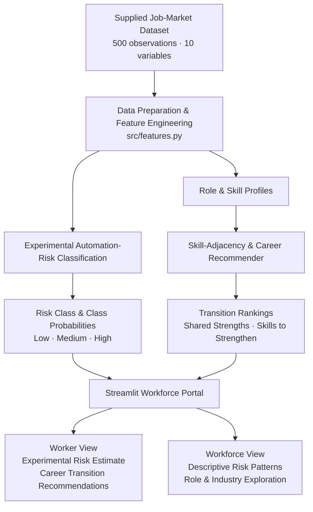

# Predictive Workforce Transition

#### AI-Powered Job Displacement Risk & Career Reskilling

**10Alytics × JengaGlobal Q3 Students Hackathon 2026 ·**

**Track C: Data Science**

> A transparent decision-support tool that provides an experimental estimate of automation risk for a role and recommends realistic, skill-adjacent career transitions, while showing users what the model predicts, why, and how much confidence to place in the result.

------------------------------------------------------------------------

#### Project Status

###### Complete

## 1. Problem

In the hackathon case study, StrataWork Global is described as having automated approximately 65% of entry-level analytics tasks using generative AI.

This creates two related problems:

- Workers facing AI-related displacement need clearer evidence about workforce risk and realistic alternative career pathways.

- Talent leaders lack an empirical framework for identifying workforce exposure and planning reskilling or redeployment.

------------------------------------------------------------------------

## 2. Target users

- **Workers**: People facing AI-related job displacement who need a clear, non-judgemental view of experimental risk signals and realistic transition pathways.
- **Talent leaders / HR:** Decision-makers who need organization-wide visibility into workforce exposure, transferable skills, reskilling needs, and potential redeployment pathways.

------------------------------------------------------------------------

## 3. Solution overview

*The solution combines:*

- AI-displacement risk modelling

- interpretable model outputs

- skill-gap analysis

- skill-adjacent career recommendations

- model validation and responsible interpretation

- an interactive Streamlit workforce portal

### Solution Architecture



------------------------------------------------------------------------

## 4. Data

The supplied dataset contains 500 job-market observations across 10 variables, including job title, industry, company size, location, AI adoption, required skill, remote-work status, salary, projected growth, and the target variable, Automation_Risk.

The target contains three approximately balanced classes: Low, Medium, and High automation risk.

See `docs/data_dictionary.md` for:

- field definitions

- data types

- missingness

- target definition

- deviations between the observed dataset and the hackathon case-study brief

A key limitation is that the supplied dataset does not contain task-level observations or individual worker records. Accordingly, the project treats automation risk as a job-market classification problem rather than an individual or task-level prediction.

------------------------------------------------------------------------

## 5. Methodology

### 5.1 Exploratory data analysis

Status: Complete

[`notebooks/01_eda.ipynb`](notebooks/01_eda.ipynb)

### 5.2 Feature engineering

Status: Complete

[`src/features.py`](src/features.py)

### 5.3 Modelling & evaluation

Status: Complete

[`notebooks/02_model_training_validation.ipynb`](notebooks/02_model_training_validation.ipynb)

### 5.4 Validity Assessment

Status: Complete

Model validity was assessed using a stratified held-out test set,
5-fold cross-validation, class-level precision, recall and F1 scores,
a confusion matrix, and comparison against the approximately one-third
chance baseline for the balanced three-class target.

The final model performed only slightly above chance, so predictive
outputs are treated as experimental rather than validated forecasts.

### 5.5 Skill adjacency & career mapping

Status: Complete

[`notebooks/03_skill_mapping.ipynb`](notebooks/03_skill_mapping.ipynb)

### 5.6 Streamlit application

Status: Complete

The Streamlit application provides two interfaces:

- **Worker View** — experimental automation-risk estimation and
  skill-adjacent career transition recommendations.
- **Workforce View** — descriptive exploration of automation-risk
  patterns across roles and industries.

The application is implemented in [`app.py`](app.py).

### 5.7 System Validation

Status: Complete

Final system validation consolidated evidence from model evaluation,
unseen-data testing, recommendation sanity checks, Streamlit testing,
limitations assessment and reproducibility checks.

Validation confirmed that:

- the classification pipeline evaluates previously unseen held-out observations;
- the career-transition recommender returns three alternative occupations;
- the current occupation is excluded from its own recommendations;
- transition scores remain bounded between 0 and 1;
- worker profiles can be processed end-to-end through the deployed application;
- the Workforce View renders descriptive role- and industry-level patterns;
- application artifacts load successfully after a fresh restart; and
- the project environment passed `python -m pip check` with no broken requirements.

[`notebooks/05_system_validation.ipynb`](notebooks/05_system_validation.ipynb)

Predictive outputs remain experimental. Exploratory analysis found no
statistically robust associations with automation risk after multiple-testing
correction, and final classification performance remained close to the
three-class chance baseline. The application therefore presents model
outputs as exploratory decision-support signals rather than validated
forecasts of individual job displacement.

------------------------------------------------------------------------

## 6. Results

### 6.1 Exploratory Analysis

The supplied dataset was complete, with 500 observations, no missing values
and no duplicate records. The automation-risk target was approximately
balanced across the three classes:

- Low: 31.6%
- Medium: 34.6%
- High: 33.8%

After Benjamini–Hochberg correction for multiple testing, no supplied feature
showed a statistically robust association with `Automation_Risk`. Pairwise
associations among the categorical features were also generally weak.

These findings indicated that the dataset contained limited predictive signal
for distinguishing automation-risk classes.

### 6.2 Automation-Risk Modelling

Multiple supervised classification approaches were evaluated, including a
Dummy classifier, Logistic Regression, Random Forest and XGBoost.

The Random Forest was retained as the experimental model used in the
Streamlit prototype.

Final Random Forest performance was:

| Metric | Result |
|---|---:|
| 5-fold CV accuracy | 0.367 |
| 5-fold CV macro-F1 | 0.358 |
| Held-out test accuracy | 0.350 |
| Held-out test macro-F1 | 0.344 |
| Approximate chance baseline | 0.33 |

Performance was therefore only slightly above the approximately one-third
chance baseline expected for the balanced three-class target. The model is
not presented as a validated predictor of real-world job displacement.

### 6.3 Career Transition Recommender

A role-level skill profile was constructed by aggregating the supplied
`Required_Skills` observations for each job title.

Cosine similarity was used to measure skill adjacency between occupations.
Candidate transitions were then ranked using a composite score combining:

- 60% skill similarity;
- 25% observed growth share; and
- 15% lower observed high-risk share.

The recommender returns three alternative occupations together with shared
strengths, skills to strengthen, salary context, growth share and observed
high-risk share.

Sanity checks confirmed that all occupations receive three recommendations,
the current occupation is excluded from its own recommendations, and
transition scores remain between 0 and 1.

### 6.4 Interactive Application

The completed Streamlit prototype provides:

- a **Worker View** for experimental automation-risk estimation, class
  probabilities, career-transition recommendations and skill-gap guidance; and
- a **Workforce View** for descriptive exploration of automation-risk
  distributions across roles and industries.

End-to-end testing confirmed that the application loads the saved model and
recommender artifacts, processes multiple worker profiles, renders both
application views and operates successfully following a fresh restart.

---

## 7. Limitations

The project should be interpreted as an experimental decision-support
prototype rather than a validated workforce forecasting system.

Key limitations include:

- **Limited predictive signal:** no supplied feature showed a statistically
  robust association with automation risk after multiple-testing correction,
  and classification performance remained close to chance.

- **Small benchmark dataset:** the analysis is based on 500 observations and
  should not be assumed to represent the wider labour market.

- **No task-level data:** although the case study discusses task automation,
  the supplied dataset contains job-market observations rather than individual
  tasks. Task-level exposure therefore cannot be estimated directly.

- **Simplified skill representation:** each observation contains only one
  `Required_Skills` category. Career recommendations are consequently based
  on aggregated role-level skill profiles rather than complete occupational
  competency profiles.

- **Dataset-to-brief discrepancies:** several variables described as continuous
  or multi-valued in the case-study brief are categorical in the supplied
  dataset, and some occupations central to the scenario are absent.

- **Unusual occupational combinations:** some job-title and skill combinations
  are atypical, limiting the real-world interpretability of the career
  recommendations.

- **Descriptive market signals:** growth and automation-risk shares used in
  career ranking describe patterns within the supplied dataset and should not
  be interpreted as external labour-market forecasts.

- **No individual-level prediction:** the dataset contains no individual
  worker records. Application outputs should therefore not be interpreted as
  probabilities that a particular person will lose their job.

Future development should validate the approach using richer external
occupational and labour-market data, including multi-skill profiles,
task-level exposure measures and longitudinal employment indicators.

---

## 8. Running the Project

### 8.1 Clone the repository

```bash
git clone https://github.com/DATAWoman2005/workforce-displacement-predictor.git
cd workforce-displacement-predictor
cd pod-nova-workforce-transition
```

### 8.2 Create and activate a virtual environment

**Windows**

```powershell
python -m venv .venv
.venv\Scripts\activate
```

**macOS/Linux**

```bash
python -m venv .venv
source .venv/bin/activate
```

### 8.3 Install dependencies

```bash
python -m pip install -r requirements.txt
```

### 8.4 Run the Streamlit application

```bash
python -m streamlit run app.py
```

Streamlit will display a local URL in the terminal. Open that address in a
web browser to access the application.

The repository includes the processed application artifacts and saved
experimental model required by `app.py`.

